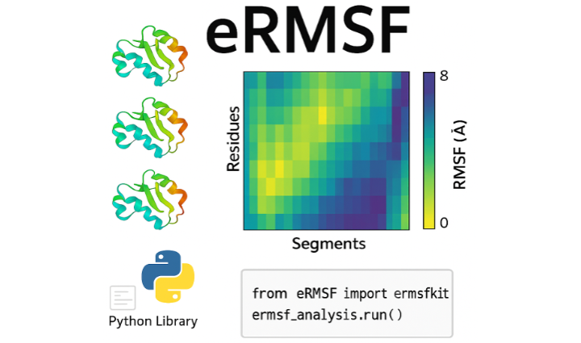

# eRMSF: Ensemble RMSF Analysis for Molecular Dynamics

[](https://github.com/pablo-arantes/ermsfkit/actions/workflows/gh-ci.yaml)
[](https://ermsf.readthedocs.io/en/latest/?badge=latest)
[](https://www.gnu.org/licenses/old-licenses/gpl-2.0.html)
[](https://www.mdanalysis.org)

## What is eRMSF?

**eRMSF** (ensemble Root Mean Square Fluctuation) is a Python package for performing time-dependent and ensemble RMSF analysis on molecular dynamics trajectories and structural ensembles.

Unlike the standard RMSF, which averages atomic fluctuations over an entire trajectory relative to the mean structure, the eRMSF partitions the trajectory into time segments and computes fluctuations relative to a **user-defined reference frame**. This enables the study of how protein flexibility evolves over simulation time or across ensemble members.

<p align="center">
  
</p>

## Key Features

- **Time-resolved flexibility analysis** — Partition trajectories into segments and track how RMSF evolves over simulation time
- **Reference-frame flexibility** — Compute fluctuations relative to any user-defined reference frame
- **MDAnalysis integration** — Built on top of the [MDAnalysis](https://www.mdanalysis.org) analysis framework
- **Numerically stable** — Uses Welford's algorithm for stable computation
- **Flexible input** — Works with any trajectory format supported by MDAnalysis (PDB, XTC, TRR, DCD, and more)

## Installation

Install directly from GitHub:

```bash
pip install git+https://github.com/pablo-arantes/ermsfkit.git
```

Or clone and install locally:

```bash
git clone https://github.com/pablo-arantes/ermsfkit.git
cd ermsfkit
pip install -e .
```

## Quick Start

```
from eRMSF import ermsfkit
import MDAnalysis as mda
import matplotlib.pyplot as plt
from MDAnalysis.tests.datafiles import PSF, DCD
from MDAnalysis.analysis import align

# Load the trajectory
u = mda.Universe(PSF, DCD)

# Align to the first frame (or average structure)
average = align.AverageStructure(u, u, select='protein and name CA',
                                 ref_frame=0).run()
ref = average.results.universe
align.AlignTraj(u, ref,
                select='protein and name CA',
                in_memory=True).run()

# Select the protein backbone (Cα atoms)
protein = u.select_atoms('protein and name CA')

# Initialize the eRMSF analysis
ermsf_analysis = ermsfkit(protein, skip=1, reference_frame=0)

# Run the analysis
ermsf_analysis.run()

# Extract results
results = ermsf_analysis.results.ermsf
```

## Parameters

| Parameter | Type | Default | Description |
|-----------|------|---------|-------------|
| `atomgroup` | AtomGroup | *required* | Atoms for which eRMSF is calculated |
| `skip` | int | 1 | Number of frames per time segment |
| `reference_frame` | int | 0 | Frame index used as reference |
| `verbose` | bool | False | Show progress during calculation |

### Jupyter Notebook (Google Colab) 

For convenience, we also provide a Google Colab notebook that allows users to run the eRMSF analysis with ease.

[](https://colab.research.google.com/github/pablo-arantes/ermsfkit/blob/main/eRMSF.ipynb)  - `eRMSF calculation with comparison to traditional RMSF.`

## Documentation

Full documentation is available at **[ermsf.readthedocs.io](https://ermsf.readthedocs.io)**, including:

- [Installation Guide](https://ermsf.readthedocs.io/en/latest/installation.html)
- [Getting Started](https://ermsf.readthedocs.io/en/latest/getting_started.html)
- [Usage Examples](https://ermsf.readthedocs.io/en/latest/usage.html)
- [Theoretical Background](https://ermsf.readthedocs.io/en/latest/theory.html)
- [API Reference](https://ermsf.readthedocs.io/en/latest/api.html)

## Requirements

- Python >= 3.9
- MDAnalysis >= 2.0.0
- NumPy

## Important Notes

- **Alignment required**: The trajectory must be aligned to a reference structure before running eRMSF. No RMSD superposition is performed internally.
- **Whole molecules**: The protein must be whole (no broken molecules across periodic boundaries).

## Citation

If you use eRMSF in your research, please cite:

> Arantes et al., *Journal of Chemical Information and Modeling*, 2025. DOI: [10.1021/acs.jcim.5c02413](https://doi.org/10.1021/acs.jcim.5c02413)

```bibtex
@article{arantes2025ermsf,
  author = {Arantes, Pablo R. and others},
  title = {eRMSF: A Python Package for Ensemble RMSF Analysis of Molecular Dynamics and Structural Ensembles},
  journal = {Journal of Chemical Information and Modeling},
  year = {2025},
  doi = {10.1021/acs.jcim.5c02413}
}
```

## Contributing

Contributions are welcome! Please see our [Contributing Guide](CONTRIBUTING.md) for details on how to get started.

## License

This project is licensed under the GNU General Public License v2.0 — see the [LICENSE](LICENSE) file for details.

## Acknowledgements

eRMSF is built on top of the excellent [MDAnalysis](https://www.mdanalysis.org) library. Project structure based on the [MDAnalysis Cookiecutter](https://github.com/MDAnalysis/cookiecutter-mdakit).

---

*Developed by [Pablo Arantes](https://pablo-arantes.github.io/)*
